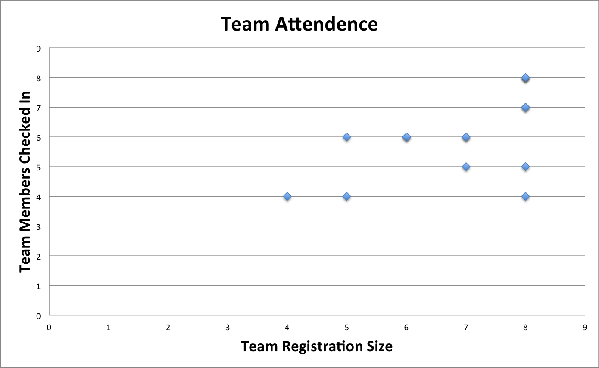
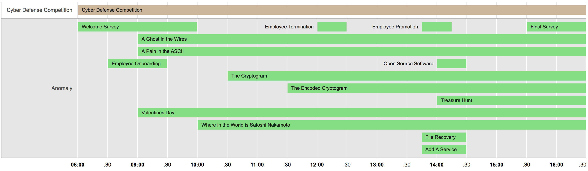

ISU Fall 2013 C3DC Anomalies
============================

This repository contains a collection of the Iowa State University Fall 2013 Community College Cyber Defense Competition (C3DC) anomalies and solutions where applicable.  The ISU C3DC anomalies are optional challenges that may be completed by participating teams within the allocated challenge time frame to earn additional points during the competition. Some anomalies are intentionally designed to provoke teams into performing an ill-advised operation that could potentially compromise the security of their network. Other anomalies are simply technical or non-technical challenges designed to engage the participant during the competition.

These anomalies were created for the Iowa State University Fall 2013 Community College Cyber Defense Competition held on December 7, 2013. These anomalies are being released under the MIT License in the hopes that they can be reused or in some way aid in learning or promotion of computer security topics. Ben Holland created this repository.

**Disclaimer:** The brief post-analysis of the C3DC anomalies given below is the work of Ben Holland and does not reflect the views or opinions of Iowa State University.  A best effort was made to collect this data during and after the competition from participant registration, participant check in sheets, the competition scoreboard, and participant feedback.  As a result some of the data and analysis may be subject to errors.  Note also that some of the challenges contain security relevant materials that could be considered malicious by some.  Please use common sense when browsing this and other past anomaly repositories.

## Participation
The ISU Fall 2013 CDC had 15 teams register to compete in the Fall 2013 Community College Cyber Defense Competition.  Before the competition, some teams disbanded and as a result a few teams members were added to the remaining teams leaving 13 participating teams during the competition.



## Anomalies
The competition had a total of 15 anomalies.  For the majority of the competition multiple overlapping anomalies were active for teams to attempt.  Partial credit was given when grading submissions (when applicable).



| **Anomaly Name**                           | **Max Score** | **Required** | **Released** |  **Expired** |        **Time Allowed** |
|----------------------------------------|:---------:|:--------:|:--------:|:--------:|--------------------:|
| Welcome Survey                         |     10    |   TRUE   |  8:00 AM | 10:00 AM |             2 Hours |
| Employee Onboarding                    |     20    |   FALSE  |  8:30 AM |  9:30 AM |              1 Hour |
| A Ghost in the Wires                   |     40    |   FALSE  |  9:00 AM |  4:30 PM | 7 Hours, 30 Minutes |
| A Pain in the ASCII                    |     10    |   FALSE  |  9:00 AM |  4:30 PM | 7 Hours, 30 Minutes |
| Valentines Day                         |     10    |   FALSE  |  9:00 AM |  4:30 PM | 7 Hours, 30 Minutes |
| Where in the World is Satoshi Nakamoto |     10    |   FALSE  | 10:00 AM |  4:30 PM | 6 Hours, 30 Minutes |
| The Cryptogram                         |     10    |   FALSE  | 10:30 AM |  4:30 PM |             6 Hours |
| The Encoded Cryptogram                 |     20    |   FALSE  | 11:30 AM |  4:30 PM |             5 Hours |
| Employee Termination                   |     10    |   TRUE   | 12:00 PM | 12:30 PM |          30 Minutes |
| Employee Promotion                     |     20    |   FALSE  |  1:45 PM |  2:15 PM |          30 Minutes |
| File Recovery                          |     10    |   FALSE  |  1:45 PM |  2:30 PM |          45 Minutes |
| Add a Service                          |     20    |   FALSE  |  1:45 PM |  2:30 PM |          45 Minutes |
| Open Source Software                   |     25    |   FALSE  |  2:00 PM |  2:30 PM |          30 Minutes |
| Treasure Hunt                          |     30    |   FALSE  |  2:00 PM |  4:30 PM | 2 Hours, 30 Minutes |
| Final Survey                           |     10    |   TRUE   |  3:30 PM |  4:30 PM |              1 Hour |

## Results
The anomalies `Employee Onboarding`, `Add a Service` and `Employee Promotion` were designed to increase the attack surface area of the network and as a result many teams decided to strategically abstain from the challenge.  The `Open Source Software` anomaly was designed to test teams on their ability to sanitize source code and the Red team was given a link to the source repositories created by the Blue teams that completed the challenge.  The remaining challenges were generally beneficial for teams to complete.  Some challenges were much more difficult than others and due to time constraints many teams did not submit all challenges.