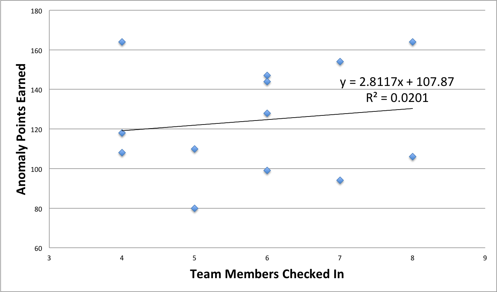
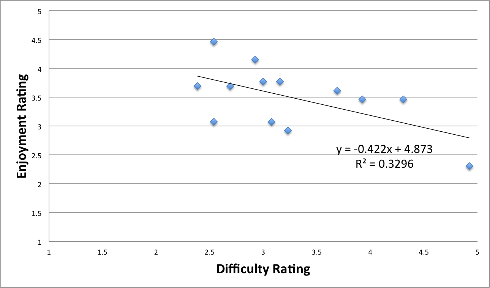

ISU Fall 2013 C3DC Anomalies
============================

This repository contains a collection of the Iowa State University Fall 2013 Community College Cyber Defense Competition (C3DC) anomalies and solutions where applicable.  The ISU C3DC anomalies are optional challenges that may be completed by participating teams within the allocated challenge time frame to earn additional points during the competition. Some anomalies are intentionally designed to provoke teams into performing an ill-advised operation that could potentially compromise the security of their network. Other anomalies are simply technical or non-technical challenges designed to engage the participant during the competition in a way that encourages them to learn something new, which may be outside of their expertise or comfort zone.

These anomalies were created for the Iowa State University Fall 2013 Community College Cyber Defense Competition held on December 7, 2013. These anomalies are being released under the MIT License in the hopes that they can be reused or in some way aid in learning or promotion of computer security topics. Ben Holland created this repository.

**Disclaimer:** The brief post-analysis of the C3DC anomalies given below is the work of Ben Holland and does not reflect the views or opinions of Iowa State University.  A best effort was made to collect this data during and after the competition from participant registration, participant check in sheets, the competition scoreboard, and participant feedback.  As a result some of the data and analysis may be subject to errors.  Note also that some of the challenges contain security relevant materials that could be considered malicious by some.  Please use common sense when browsing this and other past anomaly repositories.

## Participation
The ISU Fall 2013 CDC had 15 teams register to compete in the Fall 2013 Community College Cyber Defense Competition.  Before the competition, some teams disbanded and as a result a few teams members were added to the remaining teams leaving 13 participating teams during the competition.

## Anomalies
The competition had a total of 15 anomalies.  For the majority of the competition multiple overlapping anomalies were active for teams to attempt.  Partial credit was given when grading submissions (when applicable).

| **Anomaly Name**                           | **Max Score** | **Required** | **Released** |  **Expired** |        **Time Allowed** |
|----------------------------------------|:---------:|:--------:|:--------:|:--------:|--------------------:|
| Welcome Survey                         |     10    |   TRUE   |  8:00 AM | 10:00 AM |             2 Hours |
| Employee Onboarding                    |     20    |   FALSE  |  8:30 AM |  9:30 AM |              1 Hour |
| A Ghost in the Wires                   |     40    |   FALSE  |  9:00 AM |  4:30 PM | 7 Hours, 30 Minutes |
| A Pain in the ASCII                    |     10    |   FALSE  |  9:00 AM |  4:30 PM | 7 Hours, 30 Minutes |
| Valentines Day                         |     10    |   FALSE  |  9:00 AM |  4:30 PM | 7 Hours, 30 Minutes |
| Where in the World is Satoshi Nakamoto |     10    |   FALSE  | 10:00 AM |  4:30 PM | 6 Hours, 30 Minutes |
| The Cryptogram                         |     10    |   FALSE  | 10:30 AM |  4:30 PM |             6 Hours |
| The Encoded Cryptogram                 |     20    |   FALSE  | 11:30 AM |  4:30 PM |             5 Hours |
| Employee Termination                   |     10    |   TRUE   | 12:00 PM | 12:30 PM |          30 Minutes |
| Employee Promotion                     |     20    |   FALSE  |  1:45 PM |  2:15 PM |          30 Minutes |
| File Recovery                          |     10    |   FALSE  |  1:45 PM |  2:30 PM |          45 Minutes |
| Add a Service                          |     20    |   FALSE  |  1:45 PM |  2:30 PM |          45 Minutes |
| Open Source Software                   |     25    |   FALSE  |  2:00 PM |  2:30 PM |          30 Minutes |
| Treasure Hunt                          |     30    |   FALSE  |  2:00 PM |  4:30 PM | 2 Hours, 30 Minutes |
| Final Survey                           |     10    |   TRUE   |  3:30 PM |  4:30 PM |              1 Hour |

## Results
The anomalies `Employee Onboarding`, `Add a Service` and `Employee Promotion` were designed to increase the attack surface area of the network and as a result some teams decided to strategically abstain from the challenge.  The `Open Source Software` anomaly was designed to test teams on their ability to sanitize source code and the Red team was given a link to the source repositories created by the Blue teams that completed the challenge.  The remaining challenges were generally beneficial for teams to complete.  Some challenges were much more difficult than others and due to time constraints many teams did not submit all challenges. The `Valentines Day` anomaly contained some hashes that were unlikely to be broken in the challenge time frame and as a result the maximum score earned for the anomaly was 4 out of 10 points.  The `A Ghost in the Wires` anomaly contained two options for completing the challenge, where the easier option resulted in half points being earned.  Only one team completed the harder option of the anomaly.

| **Anomaly Name**                       | **Submitted** | **Declined** | **Unfinished** | **Average Point Percentage Earned For Submissions** |
|----------------------------------------|:-------------:|:------------:|:--------------:|------------------------------------:|
| Welcome Survey                         |     100 %     |      0 %     |       0 %      |                               100 % |
| Employee Onboarding                    |     84.6 %    |      0 %     |     15.4 %     |                              39.1 % |
| A Ghost in the Wires                   |     46.2 %    |     7.7 %    |     46.2 %     |                                50 % |
| A Pain in the ASCII                    |     92.3 %    |      0 %     |      7.7 %     |                                70 % |
| Valentines Day                         |     76.9 %    |     7.7 %    |     15.4 %     |                                29 % |
| Where in the World is Satoshi Nakamoto |     100 %     |      0 %     |       0 %      |                              96.9 % |
| The Cryptogram                         |     92.3 %    |      0 %     |      7.7 %     |                              83.3 % |
| The Encoded Cryptogram                 |     46.2 %    |     7.7 %    |     46.2 %     |                              66.7 % |
| Employee Termination                   |     100 %     |      0 %     |       0 %      |                              75.4 % |
| Employee Promotion                     |     30.8 %    |    23.1 %    |     46.2 %     |                                80 % |
| File Recovery                          |     69.2 %    |      0 %     |     30.8 %     |                              93.3 % |
| Add a Service                          |     23.1 %    |    46.2 %    |     30.8 %     |                                75 % |
| Open Source Software                   |     15.4 %    |    30.8 %    |     53.8 %     |                               100 % |
| Treasure Hunt                          |     100 %     |      0 %     |       0 %      |                               100 % |
| Final Survey                           |     100 %     |      0 %     |       0 %      |                               100 % |

Similarly to the [ISU Fall Cyber Defense Competition anomalies](https://github.com/benjholla/ISU_Fall_2013_CDC_Anomalies), the size of the team did not seem to affect the team’s ability to solve anomalies.

## Feedback
The `Final Survey` anomaly was used to gather feedback about the competition and each anomaly.  Each team ranked anomalies on a scale of 1 (terrible) to 5 (awesome) concerning enjoyment and difficulty.  Participant feedback for anomalies was mixed.  Negative feedback tended to focus around whether or not the anomalies were appropriate for the Cyber Defense Competition (“IT based” challenges Vs. "gimmicky" or “cryptography” puzzles).  Other negative feedback tended to mention the lack of manpower to complete the anomalies (although the data in the previous section doesn't necessarily support this sentiment).

| **Anomaly**                            | **Difficulty** | **Enjoyment** |                                                                                                                                                                                                                                                                    **Participant Comments**                                                                                                                                                                                                                                                                    |
|----------------------------------------|----------------|---------------|:--------------------------------------------------------------------------------------------------------------------------------------------------------------------------------------------------------------------------------------------------------------------------------------------------------------------------------------------------------------------------------------------------------------------------------------------------------------------------------------------------------------------------------------------------------------:|
| A Ghost in the Wires                   | 4.923076923    | 2.307692308   |                                                       "Couldn't find the info needed to complete." "The ghost in the wire anomaly had an issue because the 555-555-5555 is not a valid phone and also there is no 555 area code or 555 co prefix. I use to work at the telephone company for 10 years" "I didn't feel like there was enough info and it was the hardest one of all of them." "It blows, more concise instructions." "It was hard" "Completely out of the scope of any of our knowledge."                                                       |
| A Pain in the ASCII                    | 3.692307692    | 3.615384615   | "We tried but we didn't really have to manpower to tackle this one, really outside of the scope of sysadmin work." "Came up with Chinese." "I'm sure there was something simple I was missing, but I had to do all the math by hand to find the answer. We aren't cryptographers and a lot of the anomalies (read nearly all) were geared toward some sort of password cracking. Without a proper toolset for that sort of work from the beginning, it made these challenges nearly impossible while trying to maintain a network." "challenging and engaging" |
| Employee Onboarding                    | 2.692307692    | 3.692307692   |                                                                                                                       "it was ok" "This is a real thing. Most of the other anomalies weren't things you come across while admining a network." "Good, I preferred previous competitions where there was a smaller window of time, and more frequent add/delete users." "Couldn't prove that they were added. Needs better instructions."                                                                                                                       |
| Employee Promotion                     | 2.538461538    | 3.076923077   |                                                                                                                                                                                                    "don't even remember this one. Probably a good one though." "too riske'" "Good, this is more along the lines of typical sysadmin work." "We declined it."                                                                                                                                                                                                   |
| Employee Termination                   | 2.384615385    | 3.692307692   |                                                                                                                                                                                                                "We terminated him." "we missed out on this one." "Too much time to do it, more fun when we have to do it in a 5 minute window."                                                                                                                                                                                                                |
| Open Source Software                   | 3.230769231    | 2.923076923   |                                                                                                                                                                "We didn't have time, we got buried in the anomaly rush due to only having two members out on the floor." "didn't do it" "didn't complete because the guy who was in charge of this was busy, but good concept." "Didn't do it."                                                                                                                                                                |
| The Cryptogram                         | 3.153846154    | 3.769230769   |                                                                                                                      "omg" "lol" "Fun, but not sysadmin work." "tedious" "we solved it wrong because the cypher program that we used couldn't figure it out and gave us a "sample" solution instead of telling us what it was. Another team member figured this out, but was too late as we had already submitted." "You got Rick Roll'd"                                                                                                                      |
| The Encoded Cryptogram                 | 3.923076923    | 3.461538462   |                                                                                                                                                                                                                                             "Still didn't get this one." "hard but fun" "Didn't get it." "not done"                                                                                                                                                                                                                                            |
| Treasure Hunt                          | 3              | 3.769230769   |                                                                                                                                                                                                    "cool" "it was cold!" "Kind of gimmicky, especially impacted our team because half of our members didn't show :'(" "cold" "NO CAKE!!!!!!! otherwise fun."                                                                                                                                                                                                   |
| Valentines Day                         | 4.307692308    | 3.461538462   |                                                                                                                                             "it took a while" "Didn't do it." "I like the hash files, though I plugged them into john the ripper, it spit out 4 and said the rest would be ready in march." "more cryptography. John the ripper says it's going to take 4 months to solve... we only have 8 hours."                                                                                                                                            |
| Where in the World is Satoshi Nakamoto | 2.538461538    | 4.461538462   |                                                                                                                                                                                                  "we have a follower of bitcoins" "Bitcoin is something that security professionals should at least be aware of." "Web pages difficult. But enjoyable. cats."                                                                                                                                                                                                  |
| File Recovery                          | 2.923076923    | 4.153846154   |                                                                                                                                                                                                                                           "didn't get to it" "This has more real world implications." "Didn't do it."                                                                                                                                                                                                                                          |
| Add a Service                          | 3.076923077    | 3.076923077   |                                                                                                                                    "didn't get to it" "We were bogged down and didn't get this one done in time, but this is more along the lines of anomalies that I feel should be included. Setting up additional services while maintaining security wasn't a focus this year like it has been in the past." "Declined."                                                                                                                                   |

